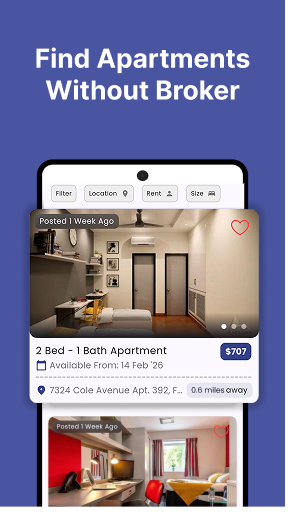
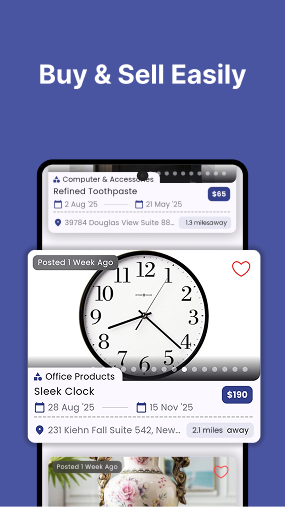
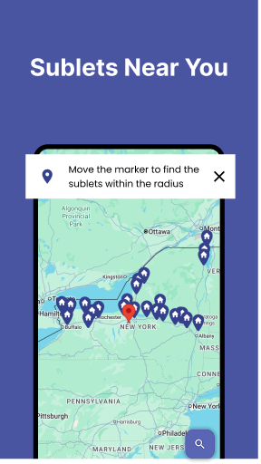
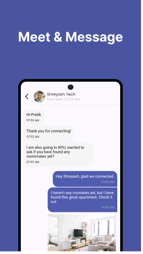

# Nesters

Nesters is a multi-service project centered on a Flutter mobile app for roommate discovery and housing-related listings, with supporting backend services for real-time chat notifications and online/offline presence.

<p align="left">
  
</p>

## Table of Contents

- [Overview](#overview)
- [Demo](#demo)
- [Tech Stack](#tech-stack)
- [Core Features](#core-features)
- [Architecture at a Glance](#architecture-at-a-glance)
- [Project Structure](#project-structure)
- [Getting Started](#getting-started)
- [Environment Configuration](#environment-configuration)
- [Running the Project](#running-the-project)
- [Usage](#usage)
- [Scripts and Commands](#scripts-and-commands)
- [Testing](#testing)
- [Configuration Files](#configuration-files)
- [Additional Documentation](#additional-documentation)
- [Contributing](#contributing)
- [License](#license)

## Overview

Nesters combines multiple workflows in one mobile app:

- **Who it is for:** users looking for roommates, sublets, apartments, or peer-to-peer marketplace listings.
- **What problem it solves:** reduces fragmented tools by combining discovery, listing, requests, chat, and user-status presence in a single experience.
- **Primary use cases:**
  - browse and post **sublets**
  - browse and post **apartments**
  - browse and post **marketplace** items
  - connect with users through **requests and chat**

This repository also contains operational services and tooling:

- a **Firebase Cloud Functions** project for notification flows
- a **Cloud Run Socket.IO service** for online/offline status
- a **Next.js admin panel scaffold**
- **seed-data tooling** (Python + Node.js)

## Demo

|  |  |  |
|:--:|:--:|:--:|
| Network | Sublet Listing | Sublet Detail |

|  |  |  |
|:--:|:--:|:--:|
| Marketplace | Maps & Location | Chat |

## Tech Stack

### Mobile app (`/`)

- **Language:** Dart (`>=3.2.0 <4.0.0`)
- **Framework:** Flutter
- **State management:** `bloc`, `flutter_bloc`, `rxdart`, `equatable`
- **Navigation:** `go_router`
- **Dependency injection / service location:** `get_it`
- **Storage:** `shared_preferences`, `get_storage`, `objectbox`
- **Backend clients:**
  - Supabase (`supabase_flutter`)
  - Firebase (`firebase_core`, `cloud_firestore`, `firebase_auth`, `firebase_messaging`, `firebase_database`, `firebase_crashlytics`, `firebase_analytics`)
- **Maps & location:** `google_maps_flutter`, `google_places_sdk`, `geolocator`
- **Media & networking:** `http`, `cached_network_image`, `image_picker`, `cloudinary`, `socket_io_client`

### Firebase Functions (`/functions`)

- **Runtime:** Node.js 18
- **Libraries:** `firebase-functions`, `firebase-admin`
- **Linting setup:** ESLint config present (`.eslintrc.js`)

### User-status socket service (`/cloud_run`)

- **Runtime:** Node.js (`>=16.0.0`)
- **Libraries:** `express`, `socket.io`, `firebase-admin`, `dotenv`
- Intended for deployment to **Google Cloud Run**

### Admin panel (`/admin_panel`)

- **Framework:** Next.js 15 + React 19
- **Language:** TypeScript/JavaScript
- **Styling:** Tailwind CSS, class-variance-authority, tailwind-merge
- **Auth package:** `next-auth` dependency included

### Data tooling (`/scripts`)

- **Python:** seed helpers and location conversion (`pandas`, `geopy`, Selenium deps in `scripts/scrapper/requirements.txt`)
- **Node.js:** Supabase seed generation (`@supabase/supabase-js`, `@faker-js/faker`, `@turf/turf`)

## Core Features

Observed from routes and feature modules in `lib/features` and repository implementations:

- authentication and onboarding flows
- profile creation/editing and roommate-visibility toggles
- multi-tab home navigation: **Network, Sublet, Apartments, Marketplace**
- listing management for:
  - sublets (list/detail/form)
  - apartments (list/detail/form)
  - marketplace items (list/detail/form/search)
- chat and request workflows between users
- favorite posts and user post management
- push-notification pipeline (FCM + local notification handling)
- real-time online/offline status integration via socket service
- crash reporting and analytics instrumentation

## Architecture at a Glance

Nesters uses a split-service model:

1. **Flutter app** handles UX, state management (BLoC), navigation, and data orchestration.
2. **Supabase** stores core listing/profile data.
3. **Firebase Firestore + FCM** supports chat/request records and notifications.
4. **Cloud Run Socket service** maintains online/offline presence updates in Realtime DB.

For detailed diagrams and flow notes, see [`docs/ARCHITECTURE.md`](docs/ARCHITECTURE.md).

## Project Structure

```text
Nesters/
├── lib/                    # Flutter source code
│   ├── app/                # App root, routing, scaffold, global blocs
│   ├── features/           # Feature modules (auth, home, listings, user, settings)
│   ├── data/repository/    # Repository interfaces/implementations and integrations
│   ├── domain/models/      # App domain entities
│   ├── theme/              # UI theming
│   └── utils/              # Shared utilities/widgets/extensions
├── assets/                 # Images, icons, fonts, lottie assets
├── android/                # Android host app + Gradle config
├── ios/                    # iOS host app + Xcode config
├── functions/              # Firebase Functions code
├── cloud_run/              # Socket service (Node.js)
├── admin_panel/            # Next.js admin scaffold
├── scripts/                # Seed and data prep tooling
├── schema_backups/         # SQL backup files for Supabase setup
├── docs/                   # Setup guides and project documentation
└── .github/workflows/      # Release and distribution workflows
```

## Getting Started

### Prerequisites

- Flutter SDK compatible with Dart `>=3.2.0 <4.0.0`
- Node.js:
  - Node 18 for `functions/`
  - Node >=16 for `cloud_run/`
- Android and/or iOS build toolchains
- Access to external services used by the app:
  - Firebase project
  - Supabase project
  - Google Maps/Places APIs
  - Cloudinary account

### Initial Setup

```bash
git clone https://github.com/Dracula-101/Nesters.git
cd Nesters
flutter pub get
cp .env.example .env
```

Then follow service-specific setup docs:

- [`docs/FIREBASE_SETUP.md`](docs/FIREBASE_SETUP.md)
- [`docs/GOOGLE_CONSOLE.md`](docs/GOOGLE_CONSOLE.md)
- [`docs/SUPABASE_SETUP.md`](docs/SUPABASE_SETUP.md)

## Environment Configuration

The mobile app loads secrets from `.env` via `flutter_dotenv`.

Required keys (from `lib/data/repository/config/app_secrets_repository.dart`):

```env
SUPABASE_URL=
SUPABASE_ANON_KEY=
SUPABASE_SERVICE_ROLE_KEY=
SUPABASE_JWT_TOKEN=
GOOGLE_WEB_CLIENT_ID=
GOOGLE_IOS_CLIENT_ID=
USER_STATUS_SOCKET_URL=
CLOUD_FUNCTION_URL=
GOOGLE_ANDROID_PLACES_API_KEY=
GOOGLE_IOS_PLACES_API_KEY=
CLOUDINARY_CLOUD_NAME=
CLOUDINARY_API_KEY=
CLOUDINARY_API_SECRET=
```

Also required:

- `android/app/google-services.json`
- `ios/Runner/GoogleService-Info.plist`
- `android/google-maps.properties`

## Running the Project

### Flutter app

```bash
dart run build_runner build --delete-conflicting-outputs
flutter run
```

Release builds:

```bash
flutter build apk --release
flutter build ipa --release
```

### Firebase Functions

```bash
cd functions
npm install
npm run serve
```

### Cloud Run socket service (local run)

```bash
cd cloud_run
npm install
npm start
```

### Admin panel

```bash
cd admin_panel
npm install
npm run dev
```

## Usage

### Mobile app flow

1. Sign in and complete your profile.
2. Navigate between Network, Sublet, Apartments, and Marketplace tabs.
3. Create or browse listings.
4. Send/receive user requests and continue conversations in chat.

### Firebase Functions surface

From `functions/index.js`, deployed functions include:

- HTTPS triggers:
  - `testNotification`
  - `testMessageNotification`
  - `sendAcceptNotification`
  - `testMessage`
  - `testRequest`
- Firestore triggers:
  - `sendNotification` on `chats/{chatId}/messages/{messageId}` create
  - `sendRequestNotification` on `users/{userId}/receivedRequests/{requestId}` create

See detailed service notes in [`docs/SERVICES.md`](docs/SERVICES.md).

## Scripts and Commands

### Root / Flutter

- `flutter pub get` — install Flutter dependencies
- `dart run build_runner build --delete-conflicting-outputs` — regenerate generated files
- `flutter run` — run app locally
- `flutter analyze` — static analysis
- `flutter test` — run tests (if present)

### `functions/`

- `npm run serve` — run Firebase Functions emulator
- `npm run shell` / `npm start` — interactive functions shell
- `npm run deploy` — deploy functions
- `npm run logs` — read function logs

### `cloud_run/`

- `npm start` — start socket status service

### `admin_panel/`

- `npm run dev` — dev server with HTTPS flag
- `npm run dev:http` — dev server over HTTP
- `npm run build` — production build
- `npm run start` — production server
- `npm run lint` — lint Next.js app

### `scripts/seed/`

- `npm start` — seed data generation script

## Testing

Current repository state:

- Flutter test dependency is configured (`flutter_test`) but no `_test.dart` files were found.
- Functions project includes `firebase-functions-test` dependency; no test files were found.

Commands to run when toolchains are installed:

```bash
flutter analyze
flutter test
cd admin_panel && npm run lint
```

## Configuration Files

- `pubspec.yaml` — Flutter dependencies, assets, fonts, SDK range
- `analysis_options.yaml` — Dart lint configuration
- `.env.example` — root app environment keys
- `scripts/config.json` — seed toggles/counts
- `.github/workflows/*.yml` — release/distribution automation

## Additional Documentation

- [`docs/ARCHITECTURE.md`](docs/ARCHITECTURE.md) — system architecture, components, and data flows
- [`docs/SERVICES.md`](docs/SERVICES.md) — backend services and runtime behavior
- [`docs/DEVELOPMENT.md`](docs/DEVELOPMENT.md) — local development workflow and troubleshooting
- Existing setup guides:
  - [`docs/FIREBASE_SETUP.md`](docs/FIREBASE_SETUP.md)
  - [`docs/GOOGLE_CONSOLE.md`](docs/GOOGLE_CONSOLE.md)
  - [`docs/SUPABASE_SETUP.md`](docs/SUPABASE_SETUP.md)

## Contributing

1. Fork the repository.
2. Create a feature branch:

   ```bash
   git checkout -b feature/your-change
   ```

3. Make focused changes.
4. Run relevant checks for the area you changed.
5. Open a pull request with clear context and testing notes.

## License

This repository currently includes the **Apache License 2.0** text in [`LICENSE`](LICENSE).
