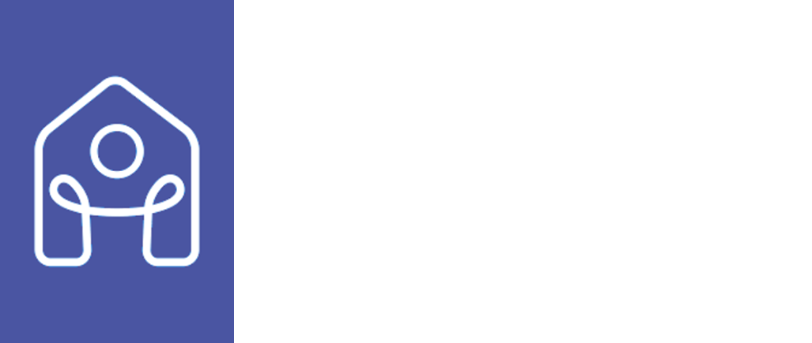

# Nesters

<!-- make a div to occupy the whole width and color = 4A55A2 and put a image in there /docs/images/nesters_bg.png with padding-->
<div>
    
</div>

<aside style="display: block; height: 20px;"></aside>

Nesters is a platform designed to help you find your next roommate and home. Whether you're looking for a roommate to share your space or searching for the ideal accommodation. Say goodbye to endless searching and let us do the work for you.

### Features

- **Find Your Perfect Roommate**: Nesters' smart matching algorithm helps you find the perfect roommate based on your preferences.
- **Connect with Your College Community**: Explore a vibrant community of students from your college.
- **Discover Your Ideal Living Space**: Post your vacant room or space and reach out to other students in need of accommodation.
- **Sublet Your Room Effortlessly**: Easily find someone to take over your lease when a room is available in the apartment.
- **Sell Before You Leave**: Prepare for your move with ease by selling your items conveniently beforehand.

## Demo

<div>
<table style="width: 100%; border-collapse: collapse; text-align: center;">
    <tr>
        <td style="border: 1px solid #ddd; padding: 8px; width: 33%;">
            
        </td>
        <td style="border: 1px solid #ddd; padding: 8px; width: 33%;">
            
        </td>
        <td style="border: 1px solid #ddd; padding: 8px; width: 33%;">
            
        </td>
    </tr>
    <tr>
        <td style="border: 1px solid #ddd; padding: 8px;">User Network</td>
        <td style="border: 1px solid #ddd; padding: 8px;">Apartment List</td>
        <td style="border: 1px solid #ddd; padding: 8px;">Sublet Details</td>
    </tr>
</table>

<table style="width: 100%; border-collapse: collapse; text-align: center; margin-top: 20px;">
    <tr>
        <td style="border: 1px solid #ddd; padding: 8px; width: 33%;">
            
        </td>
        <td style="border: 1px solid #ddd; padding: 8px; width: 33%;">
            
        </td>
        <td style="border: 1px solid #ddd; padding: 8px; width: 33%;">
            
        </td>
    </tr>
    <tr>
        <td style="border: 1px solid #ddd; padding: 8px;">Marketplace</td>
        <td style="border: 1px solid #ddd; padding: 8px;">Google Maps</td>
        <td style="border: 1px solid #ddd; padding: 8px;">Nesters Chat</td>
    </tr>
</table>
</div>

## Installation Instructions

To set up the project locally, follow these steps:

1. **Clone the repository**:

   ```sh
   git clone https://github.com/Dracula-101/Nesters.git
   cd Nesters
   ```

2. **Install dependencies**:

   ```sh
   flutter pub get
   ```

3. **Set up Firebase**:

   - Follow the instructions to set up [Firebase](docs/FIREBASE_SETUP.md) for the project.
   - Add the `google-services.json` file to the `android/app` directory.
   - Add the `GoogleService-Info.plist` file to the `ios/Runner` directory.

4. **Set up Google Maps and Places API**:

   - Follow the instructions to set up [Google Maps and Places API](docs/GOOGLE_CONSOLE.md) for the project.

5. **Set up Supabase**:

   - Follow the instructions to set up [Supabase](docs/SUPABASE_SETUP.md) for the project.
   - Copy the `.env.example` file to `.env` and add the necessary environment variables.

6. **Setup Cloudinary**:

   - Sign up for a [Cloudinary](https://cloudinary.com/users/register_free) account and create a new project.
   - Get your Cloudinary details and add it to the `.env` file.

   ```env
   CLOUDINARY_CLOUD_NAME=<your-cloud-name>
   CLOUDINARY_API_KEY=<your-api-key>
   CLOUDINARY_API_SECRET=<your-api-secret>
   ```

7. **Run the project**:
   ```sh
   flutter pub run build_runner build --delete-conflicting-outputs
   flutter run
   ```

## Usage Instructions

Once you have the project set up, you can start using it by following these steps:

1. **Sign Up / Log In**: Create an account or log in with your existing account.
2. **Create a Profile**: Fill in your profile details to help others find you.
3. **Search for Roommates**: Use the search feature to find potential roommates based on your preferences.
4. **Post a Room**: If you have a vacant room, post it on the platform to reach out to others in need of accommodation.
5. **Connect with Others**: Use the chat feature to connect with potential roommates and discuss further details.

## Contributing

We welcome contributions to Nesters! If you'd like to contribute, please follow these guidelines:

1. **Fork the repository**: Click the "Fork" button at the top right of the repository page.
2. **Clone your fork**:
   ```sh
   git clone https://github.com/your-username/Nesters.git
   cd Nesters
   ```
3. **Create a new branch**:
   ```sh
   git checkout -b feature/your-feature-name
   ```
4. **Make your changes**: Implement your feature or fix the bug.
5. **Commit your changes**:
   ```sh
   git commit -m "Add your commit message"
   ```
6. **Push to your branch**:
   ```sh
   git push origin feature/your-feature-name
   ```
7. **Create a pull request**: Go to the original repository and click the "New Pull Request" button.

## License

This project is licensed under the MIT License. See the [LICENSE](LICENSE) file for more information.